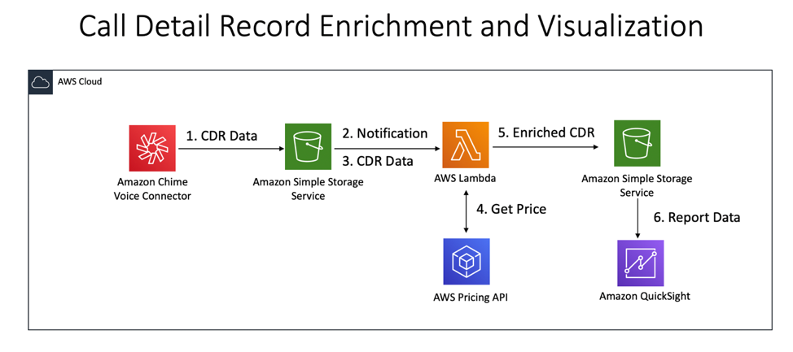
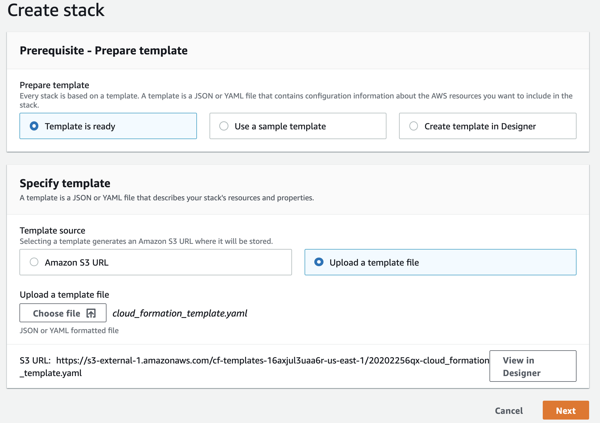
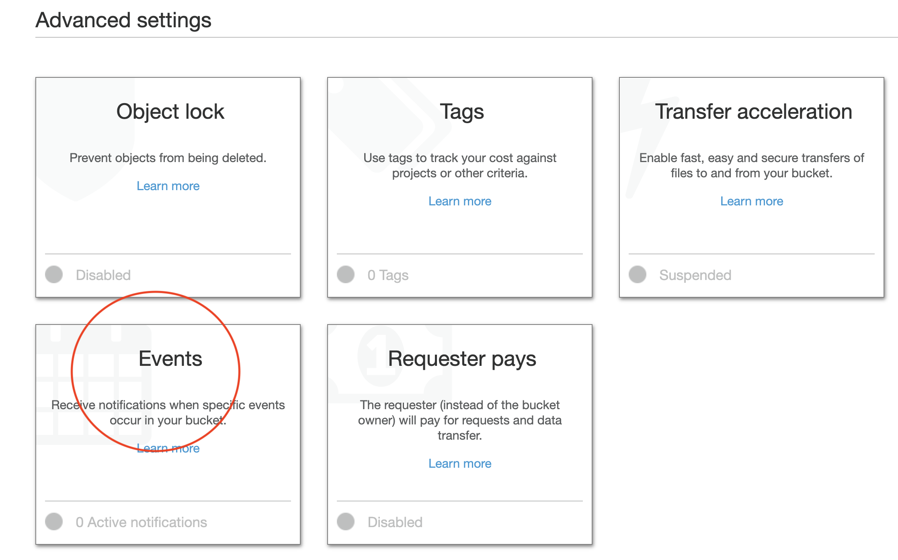
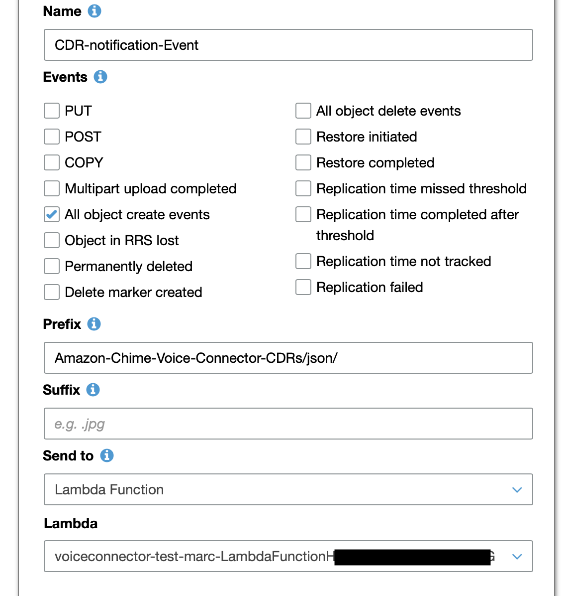
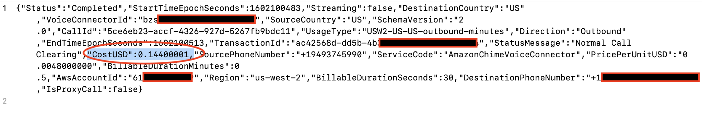

## Automating Chime Voice Connector Reports

[Amazon Chime Voice Connector](https://aws.amazon.com/chime/voice-connector) lets you place inexpensive, secure telephone calls to over 100 countries from your on-premises phone system, using your internet connection or AWS Direct Connect. Voice Connector has no upfront fees or long-term commitments, which means you pay only for the voice minutes and phone numbers you use.  

In this sample project, we will showcase how to automate the cost reporting of Amazon Chime Voice Connector. 

Whenever you place a phone call, Voice Connector generates a Call Detail Record (CDR).  The [CDR recrod](https://docs.aws.amazon.com/chime/latest/ag/manage-global.html#call-detail.html) contains information such as call time, source, and destination countries.  

This sample project enriches the CDR record with the total cost of the phone call and allows you to visualize the daily, weekly and monthly costs through AWS QuickSight.

Note: This project only processes Call Detail Records (CDR) for Chime Voice Connector.   Business Connector CDRs are not considered or processed. 

## Architecture

When configuring [Chime Voice Connector](https://docs.aws.amazon.com/chime/latest/ag/voice-connectors.html), you can enable logging by specifying an S3 bucket for the log destination.  Once Voice Connector CDR logging is enabled, Chime Voice Connector automatically places CDR records in the specified S3 bucket at the end of each phone call.  

This project processes the CDR record as soon as it is placed in the specified S3 bucket. A lambda function is triggered to enrich the CDR record with the cost of the phone call and places the final CDR record back in S3.  The lambda function leverages [AWS Pricing API](https://docs.aws.amazon.com/awsaccountbilling/latest/aboutv2/using-pelong.html) to get the latest pricing for each CDR record.  Please note that AWS Price List Service API provides the following two endpoints:

https://api.pricing.us-east-1.amazonaws.com

https://api.pricing.ap-south-1.amazonaws.com

Hence, this code makes an assumption that all artifacts, including lambda and S3 buckets will be deployed in us-east-1 (N.Virginia) region. 

Once CDR is enriched, AWS QuickSight dataset automatically refreshes to report on the new enriched data.  

### Voice Record Enrichment Flow

1.	Once CDR logging is enabled in Amazon Chime Voice Connector, CDR records are automatically sent to the specified Amazon S3 bucket (source bucket) at the end of each phone call.  
2.	When CDR record is placed in S3, a lambda event notification is triggered to enrich the CDR record with the latest pricing information.
3.	Lambda retrieves the CDR record for processing
4.	Chime Voice Connector Price List API is called to get the latest pricing for the given CDR record.
5.	CDR is enriched with the total cost and placed back on S3 (i.e. target bucket)
6.	QuickSight data is refreshed and reports are updated.

## Getting Started

### Pre-requisites
1. Chime Voice Connector has been setup - See [Creating Amazon Chime Voice Connector](https://docs.aws.amazon.com/chime/latest/ag/create-voicecon.html)
2. Voice Connector CDR logging is enabled.  The corresponding S3 bucket that stores CDR log files will be referenced as the **source** S3 bucket.  Please ensure this bucket is located in us-east-1 (N.Virginia) region.

## Quick Start
The quick start guide is intended to deploy the sample application in your own AWS account using a cloud formation template.

Quick Start Setup
1.	Sign-in to AWS or [Create an Account](https://us-west-2.console.aws.amazon.com)
2.	[Create an AWS Bucket](https://docs.aws.amazon.com/AmazonS3/latest/gsg/CreatingABucket.html).  This will be known as the **target** S3 bucket and will be used to store enriched CDR records.  Please make sure your bucket is located in us-east-1 region.
3.	Upload packaged code **‘pricefunction-1.0.0.jar’** provided in project root directory to your target AWS Bucket.
4.	Using AWS Console, select **‘CloudFormation’** from the list of AWS Services.
5.	Choose **‘Create Stack’**.  
6.	Select **‘Template is ready’** and **‘Upload a template file’**

**Note:**. Please make sure that your cloudformation region (i.e. N.Virginia) is in the same region as your source and target S3 buckets.

7.	Choose **‘cloud_formation_template.yaml’** file located in project root directory.
8.	Click **‘Next’**
9.	On the next page, specify stack details

a.	Enter a **stack name**

b.	Under Parameters, enter value for the following:

i.	**ExistingCDRBucketName** - Enter name of your existing CDR bucket. (this bucket should already be created by Chime Voice Connector)

ii.	**LambdaCode** - Specify the name of the lambda code you uploaded earlier (i.e. ‘pricefunction-1.0.0.jar’)

iii.	**TargetBucketName** – Enter the name of the target bucket you created earlier.

c.	Click **Next**

10.	Leave all of the default fields and click **“Next’**
11.	Acknowledge access capabilities and Choose **Create Stack**.

Once cloud formation has successfully completed, you should have a lambda function deployed.  

###Configuring Event Notification

1.	Select **S3 service** from AWS Console
2.	Select the original S3 bucket that stores your CDR records (This is the bucket that chime voice connector stores CDR records).
3.	Click on bucket name
4.	Click on **‘Properties’** tab
5.	Scroll down to **Advanced Settings** tab and choose **Events**

6.	Click **‘Add Notification’**
7.	Enter a name
8.	Choose **‘All object create** events’
9.	Insert **‘Amazon-Chime-Voice-Connector-CDRs/json/’** for prefix
10.	Chose Send to Lambda Function.
11.	Choose lambda function that was created by your stack

12. Click **Save**

## Test CDR Enrichment
1. Place a phone call using your Amazon Chime Voice Connector. If you would simply like to test the lambda function, you can uplaod the sample CDR provided at root of this project (cdr_sample_2) to your **source** S3 bucket.
2. Go to the **target** bucket
3. Find the CDR that corresponds to the phone call that was just made.
4. Notice that a new field - **CostUSD** which calculates the total cost of the phone call

## Deploying from the source
If you are interested in modifying this code, you can go ahead and clone the repository and follow the insructions below:

### Pre-requisites
1. Chime Voice Connector has been setup - See [Creating Amazon Chime Voice Connector](https://docs.aws.amazon.com/chime/latest/ag/create-voicecon.html)
2. Voice Connector CDR logging is enabled.  The corresponding S3 bucket that stores CDR log files will be referenced as the **source** S3 bucket.  Please ensure this bucket is located in us-east-1 (N.Virginia) region.
3. [Install Maven](https://maven.apache.org/install.html)

### Building Source code
1. Clone this repository
2. Uplaod the sample CDR record **price_lookup_function/src/test/resources/cdr_sample.json** to your source S3 bucket.
4. If running unit test:
   a. Configure **s3-event-put.json** file located under **price_lookup_function/src/test/resoruces** to match your envionrment. 
       i. specify source bucket name (i.e. Chimevoiceconnector-reports)
       ii. specify cdr key (i.e Amazon-Chime-Voice-Connector-CDRs/json/cdr_sample.json). 
6. Run **mvn clean install** to build code inside price_lookup_function

## Security

See [CONTRIBUTING](CONTRIBUTING.md#security-issue-notifications) for more information.

## License

This library is licensed under the MIT-0 License. See the LICENSE file.

