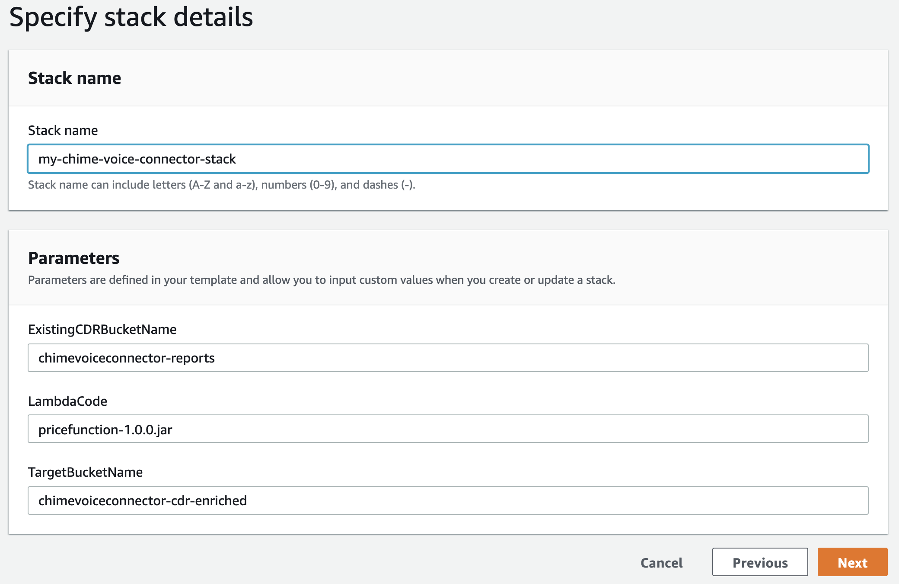

## Automating Chime Voice Connector Reports

[Amazon Chime Voice Connector](https://aws.amazon.com/chime/voice-connector) lets you place inexpensive, secure telephone calls to over 100 countries from your on-premises phone system, using your internet connection or AWS Direct Connect. Voice Connector has no upfront fees or long-term commitments, which means you pay only for the voice minutes and phone numbers you use.  

In this sample project, we will showcase how to automate the cost reporting of Amazon Chime Voice Connector. 

Whenever you place a phone call, Voice Connector generates a Call Detail Record (CDR).  The [CDR recrod](https://docs.aws.amazon.com/chime/latest/ag/manage-global.html#call-detail.html) contains information such as call time, source, and destination countries.  

This sample project enriches the CDR record with the total cost of the phone call and allows you to visualize the daily, weekly and monthly costs through AWS QuickSight.

Note: This project only processes Call Detail Records (CDR) for Chime Voice Connector.   Business Connector CDRs are not considered or processed. 

## Architecture

When configuring [Chime Voice Connector](https://docs.aws.amazon.com/chime/latest/ag/voice-connectors.html), you can enable logging by specifying an S3 bucket for the log destination.  Once Voice Connector CDR logging is enabled, Chime Voice Connector automatically places CDR records in the specified S3 bucket at the end of each phone call.  

This project processes the CDR record as soon as it is placed in the specified S3 bucket. A lambda function is triggered to enrich the CDR record with the cost of the phone call and places the final CDR record back in S3.  The lambda function leverages [AWS Pricing API](https://docs.aws.amazon.com/awsaccountbilling/latest/aboutv2/using-pelong.html) to get the latest pricing for each CDR record.  Once CDR is enriched, AWS QuickSight dataset automatically refreshes to report on the new enriched data.  

### Voice Record Enrichment Flow

1.	CDR record is sent to Amazon S3 at the end of each phone call.  Typically, the S3 bucket is automatically created by chime voice connector.
2.	When CDR record is placed in S3, a lambda event notification is triggered to enrich the CDR record with the latest pricing information.
3.	Lambda retrieves the CDR record for processing
4.	Chime Voice Connector Price List API is called to get the latest pricing for the given CDR record.
5.	CDR is enriched with the total cost and placed back on S3.
6.	QuickSight data is refreshed and reports are updated.

## Getting Started

## Quick Start
The quick start guide is intended to deploy the sample application in your own AWS account using a cloud formation template.

Quick Start Setup
1.	Sign-in to AWS or [Create an Account](https://us-west-2.console.aws.amazon.com)
2.	Create a target S3 bucket - [Create an AWS Bucket](https://docs.aws.amazon.com/AmazonS3/latest/gsg/CreatingABucket.html)
3.	Upload packaged code **‘pricefunction-1.0.0.jar’** provided in project root directory to your AWS Bucket.
4.	Using AWS Console, select **‘CloudFormation’** from the list of AWS Services.
5.	Choose **‘Create Stack’**.  
6.	Select **‘Template is ready’** and **‘Upload a template file’**

7.	Choose **‘cloud_formation_template.yaml’** file located in project root directory.
8.	Click **‘Next’**
9.	On the next page, specify stack details
a.	Enter a **stack name**
b.	Under Parameters, enter value for the following:
i.	**ExistingCDRBucketName** - Enter name of your existing CDR bucket. (this bucket should already be created by Chime Voice Connector)
ii.	**LambdaCode** - Specify the name of the lambda code you uploaded earlier (i.e. ‘pricefunction-1.0.0.jar’)
iii.	**TargetBucketName** – Enter the name of the target bucket you created earlier.

c.	Click **Next**

10.	Leave all of the default fields and click **“Next’**
11.	Acknowledge access capabilities and Choose **Create Stack**.

Be sure to:

* Change the title in this README
* Edit your repository description on GitHub

## Security

See [CONTRIBUTING](CONTRIBUTING.md#security-issue-notifications) for more information.

## License

This library is licensed under the MIT-0 License. See the LICENSE file.

